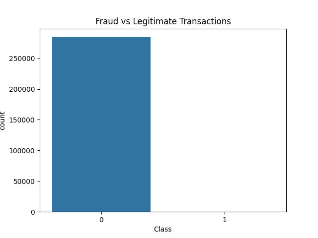
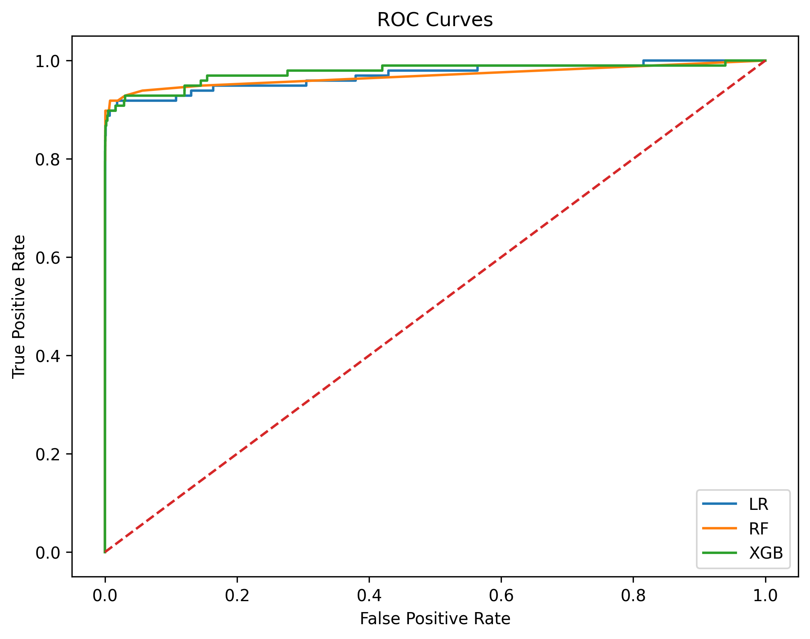
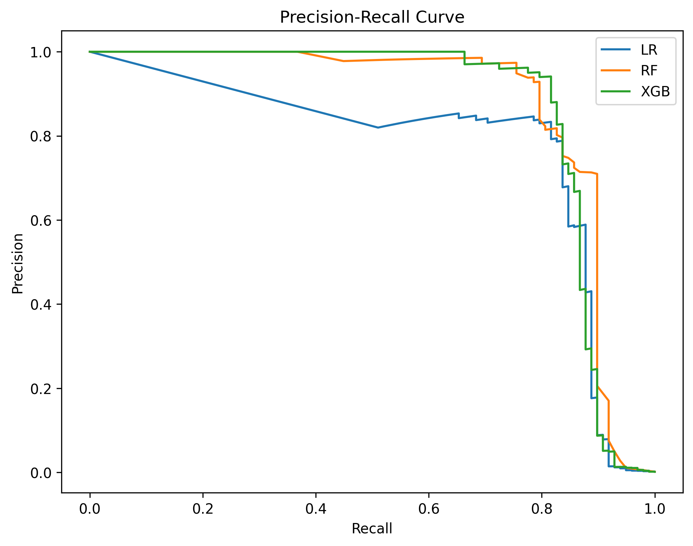
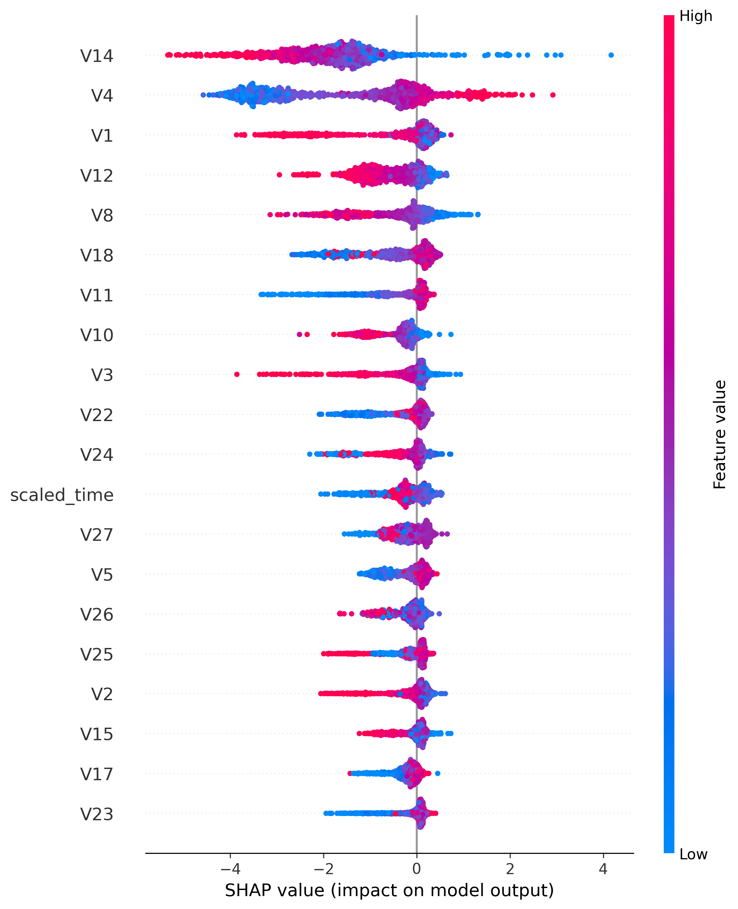

# Credit Card Fraud Detection using Machine Learning

## Overview

Credit card fraud has become a major challenge for financial institutions, leading to billions of dollars in losses worldwide every year. Detecting fraudulent transactions is particularly difficult because fraudulent activities represent only a tiny fraction of all transactions, creating a highly imbalanced dataset.

In this project, machine learning techniques are used to identify potentially fraudulent credit card transactions. The focus is not only on achieving high predictive performance but also on effectively handling class imbalance and evaluating models using metrics that are suitable for fraud detection problems.

---

## Dataset

The dataset used in this project is the **Credit Card Fraud Detection Dataset** available on Kaggle.

### Dataset Statistics

- **Total Transactions:** 284,807
- **Legitimate Transactions:** 284,315
- **Fraudulent Transactions:** 492
- **Fraud Rate:** 0.172%

The extremely low proportion of fraudulent transactions makes this a challenging real-world classification problem.

---

## Project Workflow

The project follows an end-to-end machine learning pipeline:

1. **Data Exploration**
   - Understanding the dataset structure
   - Examining class distribution
   - Identifying patterns and potential anomalies

2. **Data Preprocessing**
   - Checking for missing values
   - Preparing the dataset for model training

3. **Feature Scaling**
   - Scaling relevant features to improve model performance

4. **Train-Test Split**
   - Dividing the dataset into training and testing sets for unbiased evaluation

5. **Handling Class Imbalance**
   - Applying **SMOTE (Synthetic Minority Oversampling Technique)** to generate synthetic fraud samples and improve the learning process

6. **Model Training**
   - Training multiple machine learning algorithms

7. **Model Evaluation**
   - Comparing model performance using appropriate classification metrics

8. **Model Explainability**
   - Using **SHAP (SHapley Additive exPlanations)** to interpret predictions and understand feature importance

9. **Model Saving**
   - Saving the final trained model for future deployment and inference

---

## Models Used

The following machine learning models were implemented and compared:

- Logistic Regression
- Random Forest Classifier
- XGBoost Classifier

Each model was evaluated to determine its effectiveness in identifying fraudulent transactions while minimizing false alarms.

---

## Evaluation Metrics

Since accuracy alone can be misleading for highly imbalanced datasets, the following metrics were used:

- **Precision** – Measures how many predicted fraud cases were actually fraudulent.
- **Recall** – Measures the model's ability to identify actual fraud cases.
- **F1 Score** – Balances precision and recall.
- **ROC-AUC Score** – Evaluates the model's ability to distinguish between classes.
- **Precision-Recall Curve** – Provides deeper insight into performance on imbalanced data.

---

## Results

Among the models tested, **XGBoost demonstrated the strongest overall performance**, achieving the highest discrimination capability between legitimate and fraudulent transactions.

| Model | ROC-AUC Score |
|---------|---------------|
| Logistic Regression | 0.969848 |
| Random Forest | 0.968820 |
| XGBoost | 0.976881 |

The results highlight the effectiveness of ensemble methods, particularly XGBoost, for fraud detection tasks involving severe class imbalance.

---

## Class Distribution



## ROC Curve



## Precision Recall Curve



## SHAP Explainability



---

## Installation

```bash
git clone https://github.com/sevenvikasyadav/credit-card-fraud-detection.git

cd credit-card-fraud-detection

pip install -r requirements.txt
```

---

## Running the Project

Open the notebook:

```bash
jupyter notebook credit_card_fraud_detection.ipynb
```

or execute it directly on Kaggle.
